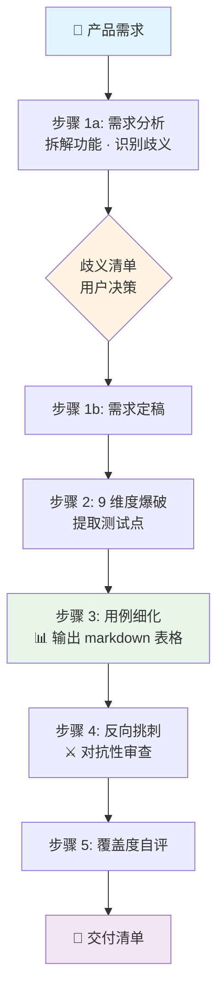

<div align="center">


# test-case-skill

### ✨ Stop writing test cases by hand. Let your AI agent do the QA work.

5 步交互式工作流，把产品需求一键拆解成可直接交付的测试用例。
支持 **Cursor / Claude Code / Codex CLI**，可粘贴 Excel / 飞书多维表格。

</div>

---

## 📋 Table of Contents

- [Features](#-features)
- [Quick Start](#-quick-start)
- [Supported Agents](#-supported-agents)
- [How it Works](#-how-it-works)
- [Examples](#-examples)
- [Scope](#-scope)
- [Design Principles](#-design-principles)
- [Roadmap](#-roadmap)
- [Contributing](#-contributing)
- [License](#-license)

---

## ✨ Features

- 🎯 **5 步串行工作流** —— 每步暂停可调整，不一次性跑完
- 🔍 **9 维度爆破测试点** —— 业务规则 / 数据类型 / 长度 / 格式 / 状态 / 交互 / 时序 / 环境 / 角色
- 📊 **直出 markdown 表格**（8 列）—— 可一键粘贴 Excel / 飞书多维表格 / Numbers
- 🛡️ **内容安全默认覆盖** —— 敏感词 / 敏感图 / 富文本注入 / 恶意链接
- 🚫 **QA 不替产品决策** —— 歧义点必须用户决策，禁止 AI 一键采纳默认假设
- ⚔️ **对抗性挑刺** —— 自带反向审查模式，主动找遗漏 / 冗余 / 不可执行

---

## 🚀 Quick Start

**方式一：用 `npx skills` 一键安装（推荐）**

```bash
npx skills add test111ddff-hash/test-case-skill
```

**方式二：手动安装（GitHub）**

```bash
mkdir -p ~/.cursor/skills/test-case-generator
curl -o ~/.cursor/skills/test-case-generator/SKILL.md \
  https://raw.githubusercontent.com/test111ddff-hash/test-case-skill/main/skills/test-case-generator/SKILL.md
```

**方式三：手动安装（Gitee 国内镜像）**

```bash
mkdir -p ~/.cursor/skills/test-case-generator
curl -o ~/.cursor/skills/test-case-generator/SKILL.md \
  https://gitee.com/chang-xinping/test-case-skill/raw/main/skills/test-case-generator/SKILL.md
```

安装后重启你的 AI Agent 即可。

---

## 📦 Supported Agents

本 Skill 为开放格式（带 YAML frontmatter 的 markdown），多个 AI Agent 工具均可使用：

| 工具 | 安装位置 | 是否原生支持 |
|---|---|---|
| Cursor | `~/.cursor/skills/test-case-generator/` | ✅ |
| Claude Code | `~/.claude/skills/test-case-generator/` | ✅ |
| Codex CLI | `~/.codex/skills/test-case-generator/` | ✅ |

`npx skills add` 会自动检测你机器上的 AI 工具并装到对应位置。

---

## 🎬 How it Works



每步暂停等你确认或调整，再进入下一步：

| 步骤 | 做什么 | 暂停等什么 |
|---|---|---|
| 步骤 1a | 拆解功能、识别测试对象、列歧义清单（4 列含 A/B/C 可能方向） | 你逐条回答歧义 |
| 步骤 1b | 基于你的歧义答案重写明确规格 | 你确认进步骤 2 |
| 步骤 2 | 9 维度爆破提取测试点 | 你确认进步骤 3 |
| 步骤 3 | 输出 8 列 markdown 表格 | 你确认进步骤 4 |
| 步骤 4 | 对抗性挑刺（遗漏 / 冗余 / 不可执行 / 优先级偏差 / 致命盲点） | 你决定采纳哪些 |
| 步骤 5 | 交付清单（覆盖矩阵 / 缺口 / 主动放弃 / 一句话总结） | 流程结束 |

---

## 📸 Examples

跑出来的实际用例（订单评价场景 · 文字输入校验，节选）：

| 用例编号 | 优先级 | 用例标题 | 测试数据 | 测试步骤 | 预期结果 |
|---|---|---|---|---|---|
| TC_TEXT_002 | P0 | 10 字节英文恰好可发 | `文字=abcdefghij` | 1. 输入 10 个英文字母 | 1. 字节数显示 10<br>2. 「发布评价」按钮变可点 |
| TC_TEXT_004 | P0 | 4 中文字 12 字节可发 | `文字=今天真好` | 1. 输入 4 个汉字 | 1. 按钮可点<br>2. 发布成功 |
| TC_TEXT_006 | P0 | 3 emoji 12 字节可发 | `文字=😀😀😀` | 1. 通过表情面板输入 3 个 😀 | 1. 按钮可点<br>2. 发布成功 |
| TC_TEXT_012 | P1 | SQL 注入字符发布 | `文字=';DROP TABLE users--` | 1. 输入并发布 | 1. 服务端正常入库无异常<br>2. 数据库未受影响 |

> 💡 整套用例集会按「所属模块」分组输出多张表，覆盖入口/校验/上传/积分/匿名展示等所有功能。

---

## 🎯 Scope

| ✅ 适用 | ❌ 不适用 |
|---|---|
| UI 功能测试用例 | 性能压测（用 JMeter / Locust） |
| 业务流程端到端 | 接口自动化（用 Postman / HttpRunner） |
| 边界异常 / 跨端兼容 | 安全渗透（用 Burp Suite） |
| 内容安全（敏感词 / 敏感图 / 富文本注入） | 单元测试（用 Jest / Pytest） |

遇到不适用场景，Skill 会主动告诉你"超出范围，建议用对应工具"。

---

## 💭 Design Principles

> 这套 Skill 不是为了"快"，是为了"对"。

- **QA 不替产品决策** —— 歧义清单的「可能方向」仅供参考，必须用户主动选择，禁止一键采纳默认
- **每步暂停** —— 5 步必须串行，不一次性跑完，每步可调整
- **可直接交付** —— 用例以 markdown 表格输出，可一键粘贴到 Excel / 飞书多维表格 / Numbers
- **明确边界** —— 性能 / 接口 / 渗透 / 单测均不在范围，明确告知用户用对应工具
- **真实可执行** —— 业务实体禁用 O1/U1 占位符，必须含数据准备步骤；步骤里不允许"飞至 UTC-5"这种非测试动作

---

## 🗺️ Roadmap

- [x] 5 步交互式工作流
- [x] 内容安全默认覆盖（敏感词 / 敏感图 / 富文本）
- [x] markdown 表格 8 列输出
- [x] 多 Agent 工具兼容（Cursor / Claude Code / Codex CLI）
- [ ] 双语 README（中英）
- [ ] 视频上传场景模板
- [ ] CI 集成示例
- [ ] 用例自动转 Postman / Pytest 脚本

---

## 🤝 Contributing

欢迎提 Issue 或 PR！

- 🐛 **Bug 反馈** · [GitHub Issues](https://github.com/test111ddff-hash/test-case-skill/issues) · [Gitee Issues](https://gitee.com/chang-xinping/test-case-skill/issues)
- 💡 **功能建议** · 提一个 Issue 描述你希望支持的场景
- 🌍 **翻译贡献** · 欢迎贡献英文 / 其它语种 README

---

## 📄 License

[MIT](LICENSE) © 2026 chang-xinping

---

<div align="center">
  <sub>Built with ❤️ for QA engineers who deserve better tooling.</sub>
</div>
